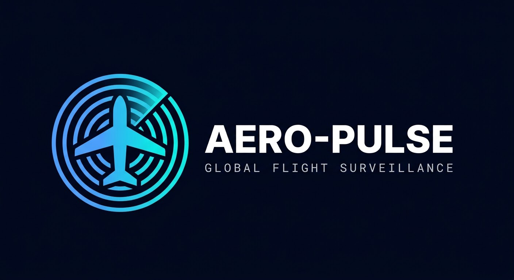

# ✈️ Aero-Pulse | Global Flight Surveillance

 


**Aero-Pulse** es una aplicación de rastreo de vuelos en tiempo real que utiliza datos satelitales en vivo de la red OpenSky. Diseñada con un enfoque en el rendimiento extremo y una interfaz de usuario táctica y moderna.

---

## 🚀 Características Principales

* **🔍 Rastreo en Tiempo Real:** Visualización de tráfico aéreo global con actualizaciones automáticas cada 60 segundos.
* **🗺️ Mapa de Alto Rendimiento:** Implementación de Leaflet con renderizado en **Canvas** para manejar cientos de marcadores a 60 FPS.
* **📱 Diseño Responsivo y Táctico:** Interfaz adaptativa construida con **Tailwind CSS v4.0.2**, optimizada para móvil y escritorio.
* **🌐 Soporte Multi-idioma:** Sistema dinámico de internacionalización (Español / Inglés).
* **⚡ Interactividad Avanzada:** Función de *Fly-To* que centra automáticamente el mapa al seleccionar un vuelo de la lista, con scroll automático en la barra lateral.
* **🛡️ Resiliencia de Datos:** Sistema de manejo de errores de API (Rate Limiting) con carga de datos de respaldo (Mock Data).

## 🛠️ Stack Tecnológico

* **Framework:** React 18+ (Vite)
* **Lenguaje:** TypeScript (Tipado estricto)
* **Estilos:** Tailwind CSS v4 (Motor Oxide)
* **Mapas:** React-Leaflet / Leaflet.js
* **Iconos:** Lucide React
* **API:** OpenSky Network API

## 📦 Instalación y Uso

1.  Clona el repositorio:
    ```bash
    git clone [https://github.com/oscardjld/aero-pulse.git](https://github.com/oscardjld/aero-pulse.git)
    ```
2.  Instala las dependencias:
    ```bash
    npm install
    ```
3.  Inicia el servidor de desarrollo:
    ```bash
    npm run dev
    ```

## 🧠 Desafíos Técnicos Superados

* **Optimización de Renderizado:** Se utilizó la propiedad `preferCanvas` en Leaflet para evitar el colapso del DOM al renderizar múltiples iconos SVG animados.
* **Arquitectura de UI en v4:** Adaptación a las nuevas *breaking changes* de Tailwind v4, utilizando variables dinámicas y eliminando sintaxis obsoleta de valores arbitrarios.
* **Experiencia de Usuario (UX):** Implementación de hooks personalizados para el manejo de la telemetría y animaciones de vuelo fluidas.

---
🔗 Live Demo: [(https://aero-pulse.netlify.app/)]
Desarrollado con ❤️ por **[Oscar Lopez (Russo)](https://github.com/oscardjld)** - *Frontend Developer & Designer*

🔗 **[Ver mi Portafolio Personal](https://portfoliorusso.netlify.netlify.app/)**
